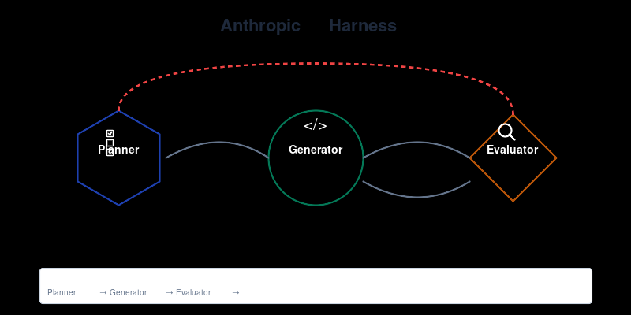
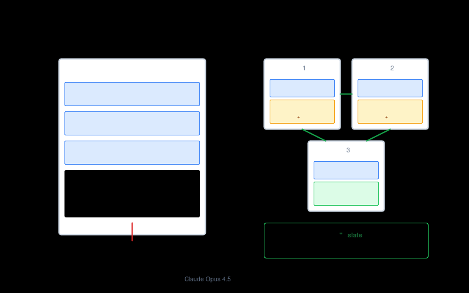
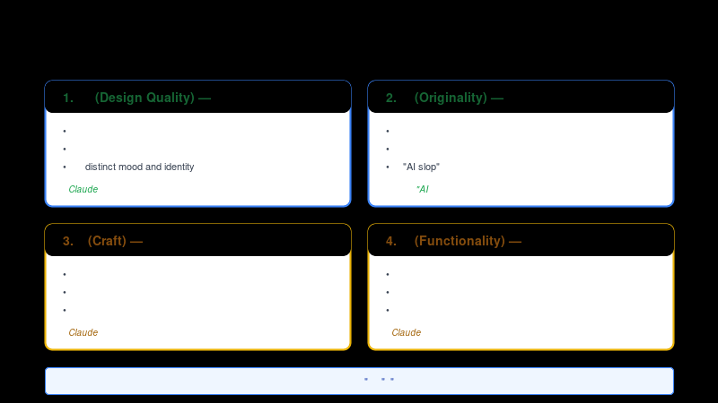

# awesome-harness-engineering

Anthropic 多智能体 Harness 设计深度解析

## 文章

📄 **[Anthropic 多智能体 Harness 设计：让 AI 持续开发复杂应用的工程实践](article.md)**

本文深入解析 Anthropic 工程师分享的 Harness 设计模式，包括：
- 为什么简单 AI 代理会"失控"
- 生成器-评估器循环的核心架构
- 前端设计质量提升实战
- 全栈应用开发实践
- 关键经验总结与应用建议

## 配图

| 图片 | 说明 |
|------|------|
|  | 多智能体 Harness 架构图 |
|  | 上下文焦虑问题与上下文重置解决方案对比 |
|  | 前端设计评估四维标准 |

## 参考文档

- [Harness design for long-running application development](https://www.anthropic.com/engineering/harness-design-long-running-apps) - Anthropic Engineering Blog
- [Effective harnesses for long-running agents](https://www.anthropic.com/engineering/effective-harnesses-for-long-running-agents) - Anthropic Engineering Blog

## 作者

flybear16
